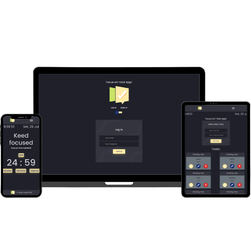

# IronHack Final project
## Focus on! Task App

Focus on! Task App is a "todo list" type website in which we can create and manage tasks, making use of CRUD with a database managed with supabase

## Technologies used

For the development of the application, the JS framework, Vue.js has been used with Pinia store, in which we also use the css framework, bootstrap.

## Demo

https://jorgegomez-amazon-ih-final-project.vercel.app/auth/login

## App web presentation

https://www.canva.com/design/DAFp_yz4Nqw/h7BOZb_GuPCUe-0zBNs4AQ/view?utm_content=DAFp_yz4Nqw&utm_campaign=designshare&utm_medium=link&utm_source=publishsharelink

## 🔗 Links

![Logo]

## Screenshots

## Features

- SignIn-SignUp profile rotate card
- Create, update and delete task
- Edit and update Profile and Avatar
- Pomodoro timer
- Fullscreen mode
- Responsive 100%
- Cross platform

## Authors

- [@jorgegomezcc](https://github.com/jorgegomezcc)

## Special Thanks

Special thanks to , Roque Berarducci for the support
Emilio Carrasco, Facundo del Medico and Nico D'Alessandro for the help and acknowledgements.
And finally to all ironhack amazon class 2023

## Contributing

Contributions are always welcome!

